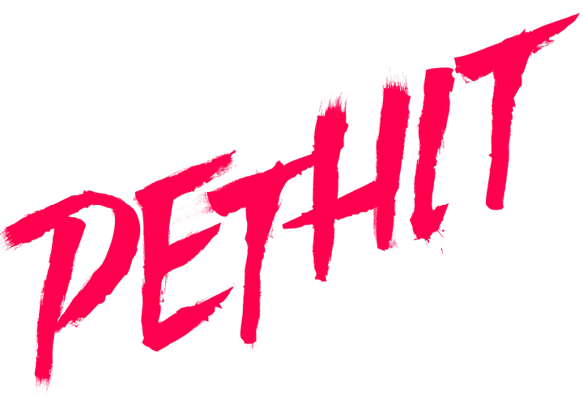
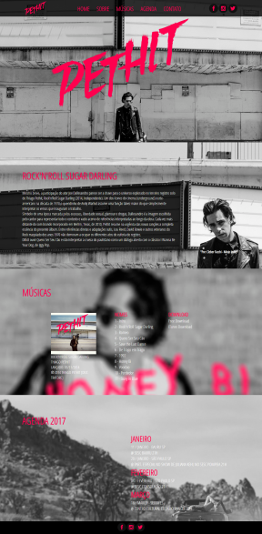

# Rock'n'roll Sugar Darling

This application is very **special** for me because it was my first project that I created from scratch. In 2016, I won a studentship to study Production and Multimedia Technician at Senac Lapa Scipião and to conclude the Programming module, we had to develop and code this project.

At that time, I developed this layout using Adobe Photoshop *(It's clear to realize that I had no notion of UI and UX, but I was really learning)*:

<table>
  <tbody>
   <tr>
      <td>
        <h3>2017</h3>
      </td>
      <td>
        &nbsp;
      <td>
       <h3>2023</h3>
      </td>
    </tr>
    <tr>
      <td>
        
      </td>
      <td>
        &nbsp;
      <td>
        
      </td>
    </tr>
  </tbody>
</table>

You can check my old layout on Behance [here](https://www.behance.net/gallery/78586015/SITE-THIAGO-PETHIT-2017). 

Unfortunately, I didn't find the code that I had developed in HTML, CSS and JavaScript, however, this project was the crucial point for me to start falling in love with development and programming, and since then I have never stopped. After six years, I decided to remake this application with new layout, new code and tecnologies. 

## But, what is Rock'n'roll Sugar Darling?
Rock'n'roll Sugar Darling is the third album by musician and actor [Thiago Pethit](https://pt.wikipedia.org/wiki/Thiago_Pethit).

## Tecnologies
- React and Vite
- Typescript
- Sass
